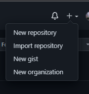
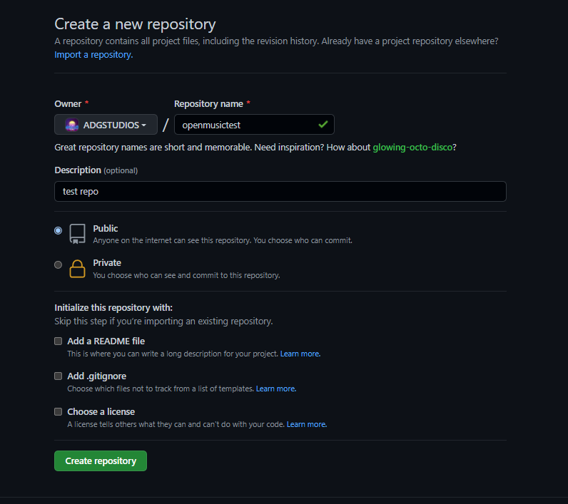
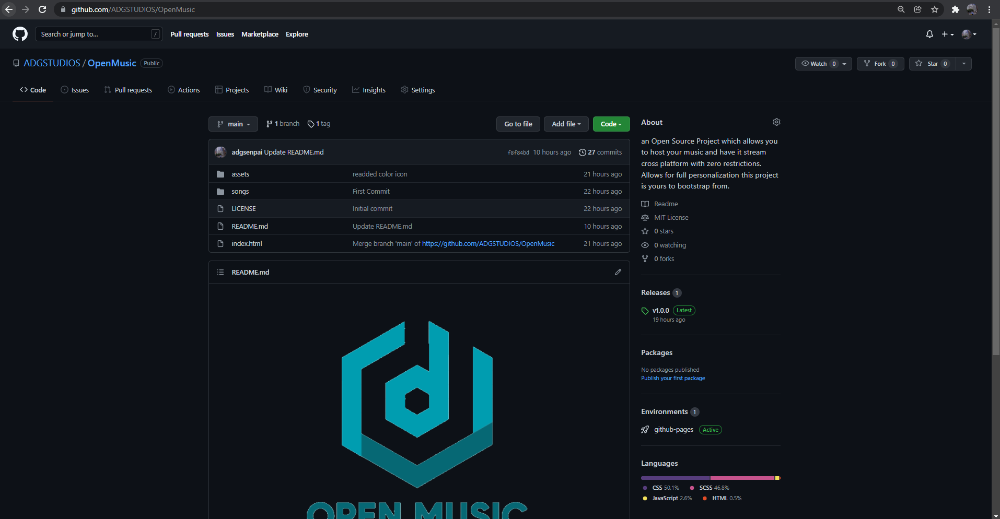
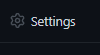
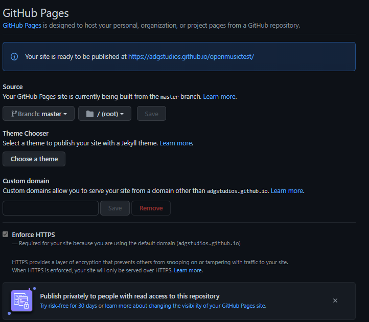

## GitHub initialization
    setting up your repo

### Create New Repo

- According to the photo below hit the `New repository` button

- Fill in the details below make sure your repo is set to `Public` (GitHub Pages is `free` when on `Public` - You pay when its on `Private`)

### Cloning Repo

in your terminal you are just gonna type 

`git clone https://github.com/ADGSTUDIOS/OpenMusic`

to continue follow the interactive terminal.

## Interactive visual terminal guide

## Deployment - final step after the terminal guide

- go to your repo and click the settings icon as in the photo below

- click pages

-  From here set your source to your `master` branch, folder to your `/root` folder and hit save

- You can point it to a custom domain if needed for that extra personalization 

- Enforce your `HTTPS` - `SSL` rules the world!

Enjoy your own streaming service.